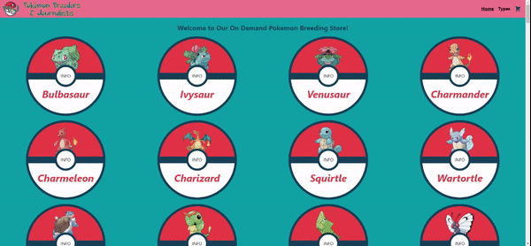

# Pokemon Breeders and Journalists: Un proyecto de React

## Flujo en el Home

En el home se puede ver el catálogo completo de la página. Clickeando en el botón "INFO" se despilega el detalle de cada ítem y la ruta se modifica
de acuerdo al ítem seleccionado. Navegando a https://dieguerson.github.io/pbnj/[el-nombre-de-un-pokemon], se puede abrir el catálogo con la información
de ese pokemon ya desplegada.

## Flujo de Types

Haciendo hover sobre Types en la NavBar se despliega la lista de tipos, de donde se puede seleccionar una para filtar la lista del catálogo.
Navegando a https://dieguerson.github.io/pbnj/types/[un-tipo], se accede al catálogo ya filtrado. Con
https://dieguerson.github.io/pbnj/types/[un-tipo]/[el-nombre-de-un-pokemon], se accede al catálogo filtrado con la información de un pokemon
desplegada.

## Flujo de Compra

Navegando a https://dieguerson.github.io/pbnj/cart se accede directamente al carrito. Otra opción es clikear el ícono en la NavBar o el botón de
checkout luego de realizar el Add to Cart.

## Herramientas de Desarrollo
- **ReactJS**: Herramienta principal para el desarrollo de la aplicación.
- **Tailwind CSS**: Librería de CSS para dar todos los estilos a la aplicación.
- **HeroIcons**: Librería de íconos.
- **react-router-dom**: Paquete para manipular el routing de la app.
- **Firebase**: Aplicación de Google para hacer a la aplicación serverless.
- **gh-pages**: Paquete para realizar el deploy a GitHub Pages.

## Setup
Después de clonar el repo hacer **npm i** para acceder a todas las librerías y paquetes necesarios.
Para iniciar el servidor de desarrollo: **npm start**
Para hacer deploy: **npm run deploy**

**Última actualización: 20/02/2022**